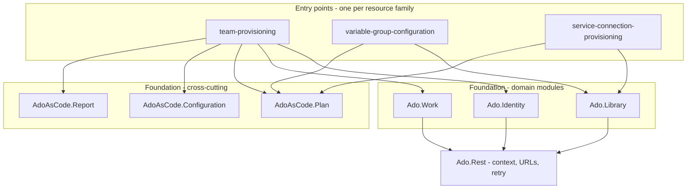

# Azure DevOps as Code

Declarative, reviewable configuration for Azure DevOps project resources — Teams and
Boards, Variable Groups, Service Connections — in PowerShell against the REST API, with
no runtime dependency beyond PowerShell itself.

Every change is planned before it is applied, nothing is ever deleted, and no
credential is ever committed.

```powershell
.\automations\team-provisioning\Invoke-TeamProvisioning.ps1 -Command plan  -ApplicationKey APP_ALPHA
.\automations\team-provisioning\Invoke-TeamProvisioning.ps1 -Command apply -ApplicationKey APP_ALPHA -ConfirmApply
```

---

## The problem

A team project accumulates configuration the way a house accumulates keys. Teams, Area
Paths, Board columns, Variable Groups, Service Connections — each created in the portal,
by whoever needed it, on the day they needed it.

Individually, two-minute jobs. Collectively: environments that differ and nobody decided
they should, no reviewable statement of intent, no dry run, and dependencies that exist
only in somebody's memory. Nobody can answer *"is this project configured the way we
intend?"* — which is the question that matters the morning after something breaks.

Full version: [docs/overview/problem-statement.md](docs/overview/problem-statement.md).

## Why it is harder than it looks

Three properties of the Azure DevOps API turn "just automate it" into a real design
problem. Each has an implementation that appears to work and destroys something.

| The API behaviour | The obvious implementation | What it destroys |
| --- | --- | --- |
| Board columns have no per-column route — writing replaces the whole collection | Send the declared columns | Every column somebody added but nobody declared, plus the Work Items on it |
| A Variable Group `PUT` stores an omitted value as an **empty string** | Omit the secret so it is "left alone" | The secret. Invisibly, until a deployment fails to authenticate |
| A Service Connection `GET` never returns its credential, and the only update is a full `PUT` | Read, modify, write | The credential, replaced with null, while the API reports success |

Handling these is most of what this repository is.
[docs/reference/azure-devops-notes.md](docs/reference/azure-devops-notes.md) documents
fifteen such behaviours, each with the symptom it produces.

## Approach

| Principle | In practice |
| --- | --- |
| **Declare, then plan, then apply** | `plan` writes nothing; `apply` needs `-ConfirmApply` and refuses a plan with any blocked operation |
| **Never delete** | Every writer is additive. Undeclared resources are preserved and reported |
| **Names, not values** | Configuration declares the *name* of the environment variable holding a secret, so the whole declaration is committable |
| **Idempotent by design** | A change is done when a second `plan` reports nothing pending — the acceptance criterion, not an optimisation |
| **Evidence for every run** | A report before, a receipt written after *every* completed operation, so an interrupted run is a resume rather than a guess |

## Architecture



Dependencies point downward, never sideways. The shared layer carries no domain rules —
the moment it grows an `if this is a board` branch it has become a monolith with extra
steps. See [docs/reference/architecture.md](docs/reference/architecture.md).

## Modules

| Module | Owns | Guide |
| --- | --- | --- |
| `team-provisioning` | Teams, members, Area and Iteration Paths, Board columns | [guide](docs/guides/team-provisioning.md) |
| `variable-group-configuration` | Variable Groups and their non-secret values | [guide](docs/guides/variable-group-configuration.md) |
| `service-connection-provisioning` | SSH/SFTP Service Connections | [guide](docs/guides/service-connection-provisioning.md) |

Every module exposes the same ladder, and only the last three can write:

| Command | Reads live state | Writes | Confirmation | From a pipeline |
| --- | --- | --- | --- | --- |
| `validate` | No | No | — | Yes |
| `inventory` | Yes | No | — | Yes |
| `plan` | Yes | No | — | Yes |
| `smoke` | Yes | No | — | Yes |
| `apply` | Yes | **Yes** | `-ConfirmApply` | Yes |
| `reconcile` | Yes | **Yes** | `-ConfirmApply` | Yes |
| `rename` | Yes | **Yes** | `-ConfirmApply -ConfirmRename` | **No — workstation only** |

`rename` is deliberately absent from the pipeline definitions. It rewrites
`System.AreaPath` on every Work Item below the path, which is the one operation here
whose blast radius is not bounded by the plan, so it is not something to trigger from a
form. See [pipelines/README.md](pipelines/README.md).

## Quickstart

```powershell
# 1. Prepare the workstation. Checks prerequisites, creates .env from the template.
.\scripts\bootstrap.ps1

# 2. Fill in ADO_ORG_URL, ADO_PROJECT and ADO_PAT in .env

# 3. Check the configuration - offline, no credentials needed
.\automations\team-provisioning\Invoke-TeamProvisioning.ps1 -Command validate

# 4. See what would change
.\automations\team-provisioning\Invoke-TeamProvisioning.ps1 -Command plan -ApplicationKey APP_ALPHA

# 5. Apply the approved plan, then confirm it landed
.\automations\team-provisioning\Invoke-TeamProvisioning.ps1 -Command apply -ApplicationKey APP_ALPHA -ConfirmApply
.\automations\team-provisioning\Invoke-TeamProvisioning.ps1 -Command plan  -ApplicationKey APP_ALPHA
```

Step 5 twice is not a typo. A re-plan that comes back entirely `ok` is how this
repository defines a finished change.

Full walkthrough with the expected output of each step:
[docs/guides/end-to-end-walkthrough.md](docs/guides/end-to-end-walkthrough.md).
When something goes wrong: [docs/guides/troubleshooting.md](docs/guides/troubleshooting.md).

### What goes in `.env`

Configuration files declare the **name** of a variable; only [.env.example](.env.example)
holds values, and it is the file `bootstrap.ps1` copies for you.

| Variable | Needed by | Notes |
| --- | --- | --- |
| `ADO_ORG_URL`, `ADO_PROJECT`, `ADO_PAT` | Everything that touches the API | `validate` needs none of them |
| `<APP>_MEMBERS` | `team-provisioning` | Sign-in addresses separated by `;`, `,` or newline |
| `<KEY>_<ENV>` | `variable-group-configuration` | A **secret** group value, qualified with the environment. Non-secret values live in the values CSV, not here |
| `SFTP_<APP>_<ENV>_{HOST,USERNAME,PASSWORD,PRIVATE_KEY}` | `service-connection-provisioning` | Names come from `credentialVariables` |

Field by field: [configuration-reference.md](docs/reference/configuration-reference.md).

### Overriding a path

Every entry point defaults every file it reads, so a caller overrides only what differs:
`-EnvFile`, `-ProjectContextPath`, `-ConfigurationPath`, `-ScopePath`, `-CsvPath`,
`-BoardColumnsPath`, `-ReportPath`. Three switches widen what a command may do —
`-ForceUpdate` and `-ForceCredentialOverwrite` (Service Connections) and
`-AllowUnqualifiedSecretName` (Variable Groups) — and each is documented in the entry
point's own `Get-Help`, including why it is opt-in.

## What this repository demonstrates

- **Designing around a hostile API.** Three destructive edges, each handled with a
  measured guard rather than a hopeful one, and each covered by a test that names the
  failure it prevents.
- **A plan/apply model built from scratch** — a closed action and status vocabulary, a
  single gate that refuses a blocked plan, and reasons written for the person approving
  rather than for a log parser.
- **Idempotency treated as a design constraint.** Drift is defined against the payload
  that would be sent, not against the declaration, which is what makes a second run a
  genuine no-op — [ADR 0006](docs/adr/0006-idempotency-as-acceptance-criterion.md).
- **Secret handling with no committed secrets.** Configuration declares variable names;
  redaction happens at the report writer; a two-layer gate fails the build on anything
  credential-shaped.
- **Modular PowerShell.** Seven modules with manifests and explicit exports,
  `Set-StrictMode -Version Latest` throughout, 127 Pester tests, PSScriptAnalyzer clean,
  running on Windows PowerShell 5.1 and PowerShell 7.
- **Documentation as a deliverable.** Problem statement, capability catalogue, delivery
  method, risk register, ADRs, and a per-module guide that has to say how to reverse
  what it did — with continuous integration failing on an unindexed document or a broken
  link.

## Repository layout

| Path | Contains |
| --- | --- |
| `foundation/` | The shared layer: seven modules, the project context, and the loader |
| `automations/` | One directory per automation: entry point, config, schemas, guide |
| `pipelines/` | One Azure DevOps YAML per automation — see [pipelines/README.md](pipelines/README.md) |
| `scripts/` | `bootstrap.ps1`, `Invoke-Tests.ps1`, `Test-NoSensitiveData.ps1` |
| `tests/` | Pester suite and shared fixtures |
| `docs/` | [Documentation index](docs/README.md) |
| `.github/workflows/` | The quality gate and the documentation check that run on every PR |
| `.env.example` | Template for `.env`, and the only place variable values are named |
| `PSScriptAnalyzerSettings.psd1` | Analyzer rules, each exclusion with its reason beside it |
| `.local/` | Workstation scratch space. Ignored by Git; may hold real credentials |
| `artifacts/` | Plans, reports and receipts from a run. Ignored by Git |

## Quality gate

```powershell
.\scripts\Invoke-Tests.ps1
```

Parse check, PSScriptAnalyzer, 127 Pester tests, and a sensitive data scan. Continuous
integration runs the identical command on `windows-latest`, so "it passed locally" and
"it passed in CI" mean the same thing.

Running the automations needs nothing but PowerShell. Running the **gate** needs two
modules, which `bootstrap.ps1 -CheckOnly` reports on and CI installs:

```powershell
Install-Module Pester -MinimumVersion 5.5 -Scope CurrentUser
Install-Module PSScriptAnalyzer -Scope CurrentUser
```

## Scope

Three resource families, covered properly, rather than every resource covered thinly.
Deliberately out of scope: pipeline definitions, repositories and branch policies,
project permissions, work item content, and any integration with an external tracker.

Deliberately **not implemented**, because the operation cannot be made safe: renaming a
Service Connection, writing a secret value, and deleting anything at all. Each is
reported as manual work with the reason attached, rather than shipped as a feature whose
successful path is a silent failure.
[docs/overview/scope-and-limits.md](docs/overview/scope-and-limits.md) explains each one.

## Documentation

Start at the [documentation index](docs/README.md), which routes by need rather than by
folder.

| If you want to | Read |
| --- | --- |
| Run it | [getting-started.md](docs/guides/getting-started.md) |
| See it work end to end | [end-to-end-walkthrough.md](docs/guides/end-to-end-walkthrough.md) |
| **Fix something that went wrong** | [troubleshooting.md](docs/guides/troubleshooting.md) |
| Know exactly what it does | [capabilities.md](docs/overview/capabilities.md) |
| Fill in a configuration file | [configuration-reference.md](docs/reference/configuration-reference.md) |
| Run it from Azure Pipelines | [pipelines/README.md](pipelines/README.md) |
| Understand how the work was done | [delivery-approach.md](docs/process/delivery-approach.md) |
| Learn the API traps | [azure-devops-notes.md](docs/reference/azure-devops-notes.md) |
| Add an automation | [automation-contract.md](docs/reference/automation-contract.md) |

## Notes

This is a reference implementation, generalised from production work. All names, hosts
and identifiers are placeholders: `contoso`, `APP_ALPHA`, `Platform`. It is not a
supported product.

Licensed under the [MIT License](LICENSE). Security policy:
[SECURITY.md](SECURITY.md). Contributing: [CONTRIBUTING.md](CONTRIBUTING.md).
