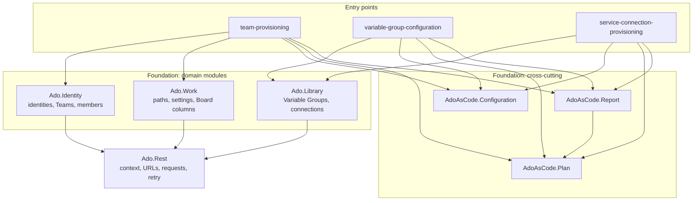

# Architecture

**Purpose.** Describe the layers, the rule that governs dependencies between them, and
the lifecycle every automation follows.

**Scope.** Structure. Per-module behaviour is in the guides.

**Audience.** Anyone changing the code or adding an automation.

**Related documents**

- [automation-contract.md](automation-contract.md) — what a new module must provide
- [command-model.md](command-model.md) — the lifecycle in detail
- [0004-shared-foundation-without-domain-rules.md](../adr/0004-shared-foundation-without-domain-rules.md) — why the shared layer is thin

## 1. Layers



| Layer | Holds | Never holds |
| --- | --- | --- |
| **Entry points** (`automations/*/Invoke-*.ps1`) | The command surface and the rules of one resource family. | Anything another automation needs. |
| **Domain modules** (`Ado.Identity`, `Ado.Work`, `Ado.Library`) | How to read and write one part of Azure DevOps, safely. | Which applications exist. |
| **Cross-cutting** (`AdoAsCode.*`) | Configuration loading, the plan model, evidence writing. | Any Azure DevOps knowledge at all. |
| **Transport** (`Ado.Rest`) | URLs, authentication, retry, error translation. | Any knowledge of Teams, Boards or groups. |

## 2. The dependency rule

**Dependencies point downward, never sideways or up.**

| Allowed | Forbidden |
| --- | --- |
| An entry point using any foundation module | A foundation module knowing an application key |
| A domain module using `Ado.Rest` | A domain module using another domain module |
| Anything using `AdoAsCode.Plan` | An entry point calling another entry point |

The second forbidden case is the one worth stating twice. `Ado.Rest` growing an
`if this is a board` branch would make it a second monolith with extra steps. When
shared code needs to know which domain it is in, the logic belongs one layer up.

## 3. Lifecycle

Every automation exposes the same ladder, and only the last three can write.

```text
validate -> inventory -> plan -> smoke -> apply
 offline    read-only    read     read    writes, with confirmation
```

| Verb | Reads live state | Writes | Confirmation |
| --- | --- | --- | --- |
| `validate` | No | No | — |
| `inventory` | Yes | No | — |
| `plan` | Yes | No | — |
| `smoke` | Yes | No | — |
| `apply` | Yes | **Yes** | `-ConfirmApply` |
| `reconcile` | Yes | **Yes** | `-ConfirmApply` |
| `rename` | Yes | **Yes** | `-ConfirmApply -ConfirmRename` |

`validate` reaching the network would defeat its purpose: a newcomer has to be able to
check their configuration before asking anyone for a token. The test suite enforces
this by running it with the credential variables cleared.

## 4. Data flow of an apply

```mermaid
sequenceDiagram
    participant U as Operator
    participant E as Entry point
    participant C as AdoAsCode.Configuration
    participant D as Domain module
    participant A as Azure DevOps
    participant R as AdoAsCode.Report

    U->>E: apply -ApplicationKey X -ConfirmApply
    E->>C: load declaration, validate against schema
    E->>D: read live state
    D->>A: GET
    E->>E: build plan
    E->>E: Assert-PlanApplicable (refuses if anything is blocked)
    loop each operation
        E->>D: write
        D->>A: POST / PATCH / PUT
        E->>R: Save receipt (status in_progress)
    end
    E->>R: Save receipt (completed), write report
    E-->>U: "run plan again; everything should be ok"
```

Two properties of this flow carry most of the safety:

- The plan is recomputed from live state immediately before the first write, so an
  apply can never run against a plan somebody read yesterday.
- The receipt is saved inside the loop, not after it. A run that dies at operation
  four still records operations one to three.

## 5. Repository layout

| Path | Contains |
| --- | --- |
| `foundation/modules/` | Seven modules, each with a manifest declaring its exports. |
| `foundation/config/`, `foundation/schemas/` | Shared context and its schema. |
| `foundation/Import-Foundation.ps1` | Puts the modules on `PSModulePath` and imports them in dependency order. |
| `automations/<name>/` | Entry point, `config/`, `schemas/`, `examples/`, `README.md`. |
| `pipelines/` | One YAML per automation. |
| `scripts/` | `bootstrap.ps1`, `Invoke-Tests.ps1`, `Test-NoSensitiveData.ps1`. |
| `tests/` | Pester suite and shared fixtures. |
| `docs/` | This documentation. |
| `artifacts/`, `.local/` | Run output and workstation values. Excluded from version control. |

## 6. Why real modules with manifests

The foundation ships as `.psd1` + `.psm1` rather than dot-sourced scripts, and the
difference is not ceremony:

| Property | Effect |
| --- | --- |
| `FunctionsToExport` is explicit | A helper stays private. Making it public is a visible change to the manifest, reviewable as such. |
| `RequiredModules` | The dependency graph is declared and enforced at import, not discovered when something is missing. |
| Module scope | A module variable cannot be clobbered by a caller, and vice versa. |
| `Set-StrictMode -Version Latest` per module | A typo in a property name is an error, not `$null`. |

That last one is not free — it means partial objects have to be read through a guard —
but it converts a class of silent wrong answers into loud failures.

There is one deliberate exception: `Import-Foundation.ps1` is dot-sourced, so it shares
the caller's scope. Every variable in it is prefixed for that reason, and the comment
in the file says why: an unprefixed loop variable there once overwrote the caller's own
`$moduleName`, and the error surfaced three layers away.
